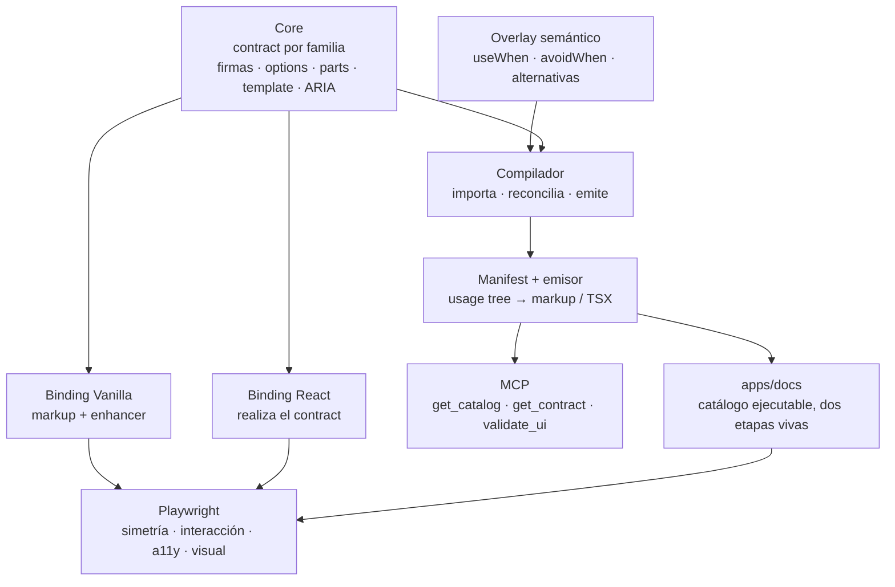

# Plataforma AI UI

**Cómo una IA consume skryensya/ui para construir interfaces y sitios web**

| | |
|---|---|
| **Estado** | En construcción · F0–F3 y F5 completas; F4 completa salvo las ancladas (46 familias, 86 firmas); F6 en curso (9 recetas, 16 de 349 llamadas convertidas) |
| **Fecha** | 28 de julio de 2026 |
| **Supersede** | `apps/docs/01_arquitectura_objetivo_skryensya_ai_ui.md` y `apps/docs/02_plan_reconstruccion_desde_cero_skryensya_ai_ui.md`, que quedan como material de origen y no dirigen el trabajo |
| **Decisiones** | [28](./decisiones/0013-el-contrato-vive-en-core-y-los-frameworks-son-bindings.md) · [29](./decisiones/0014-el-usage-tree-es-la-moneda-unica.md) · [30](./decisiones/0015-la-evidencia-se-renderiza-en-los-dos-bindings.md) · [31](./decisiones/0016-el-catalogo-cabe-en-el-contexto.md) |
| **Vocabulario** | `CONTEXT.md` → Contract, Binding, Signature, Part template, Usage tree |

> **Principio rector**
>
> La IA no memoriza documentación ni adivina APIs. Consulta un contrato compilado, propone una
> composición como dato, y recibe de vuelta el código que esa composición produce. Después demuestra
> el resultado renderizándolo.

---

## 1. El modelo en una página



Tres afirmaciones sostienen todo lo demás:

1. **Hay un solo contrato y vive en core.** React y Vanilla no son dos verdades: son dos vistas de
   una. Un binding que redeclara una opción rompe el build.
2. **Hay una sola moneda y es el usage tree.** El mismo dato es el ejemplo de la documentación, el
   snippet, el plan que el agente propone, el código que recibe y el caso que corren los gates.
3. **La evidencia se renderiza.** Un veredicto estático nunca declara que una página está bien. Los
   dos bindings se renderizan y se comparan.

---

## 2. En qué se aparta esto de los documentos 01 y 02

Once puntos, y ninguno es de detalle:

| # | Documentos 01 / 02 | Esta arquitectura | Por qué |
|---|---|---|---|
| 1 | TypeScript y los `.d.ts` publicados son la autoridad | **Core** es la autoridad; TypeScript prueba una sola afirmación | `@skryensya/react` exporta *source*, no `.d.ts`; y los tipos no pueden expresar anidamiento de parts ni ARIA condicional |
| 2 | Solo se modela la ruta React | **Dos bindings simétricos**, React y markup autoreado | El sitio consume vanilla, los apps consumen React; documentar una sola ruta deja la otra sin contrato |
| 3 | El markup no aparece | **Markup contract y part template** son primera clase | `navListParts` tiene 8 parts y React expone 3 surfaces: alguien tiene que declarar la equivalencia |
| 4 | Stories CSF como unidad de ejemplo | **Usage tree** | Un árbol se renderiza en los dos bindings; una story CSF, en uno |
| 5 | Storybook para G2/G4/G5 y su MCP | **`apps/docs` es el catálogo ejecutable** | Storybook se construyó acá y se borró a propósito; el sitio ya renderiza los dos bindings en 57 de 67 páginas |
| 6 | El MCP valida y no emite | **`validate_ui` devuelve el código emitido** | Validar props y después teclear otra cosa era el agujero real |
| 7 | No existe gate de simetría | **DOM-diff entre bindings (G2)** | Es lo que convierte "dos bindings" en algo verificable |
| 8 | BM25 ponderado, corpus, Recall@k, MRR, aliases bilingües | **Sin ranker** ni aliases: el índice completo va al contexto | El ranker actual documenta que listar todo funciona mejor, y los aliases sólo existían para alimentarlo |
| 9 | Evals miden la recuperación | **Evals miden la composición final** | Sin intermediario, no hay posición que medir |
| 10 | Matriz de 8 responsables, 12 PRs, aprobaciones cruzadas | **Un autor, fases con exit gate binario** | Es la realidad de este repositorio |
| 11 | Recipes destilados de stories | **Recipes autoreados, pero renderizados por una página real** | Un recipe que nada renderiza no es evidencia de nada |

---

## 3. El contrato

Core exporta, por familia, un valor `as const` tipado por un `ComponentContract` compartido. Es un
valor y no un tipo porque el markup es dato: se importa, se serializa y sale determinista, sin
TypeScript Program para el grueso.

```ts
// packages/core/src/button.ts: dos firmas sobre un export, discriminadas por href
export const buttonContract = {
  id: "button",
  css: "@skryensya/core/components/button.css",
  parts: buttonParts,                    // { root: "sk-button", interactive: "sk-interactive" }

  options: {
    variant:  { type: "enum", values: ["neutral", "primary", "danger", "ghost"], default: "neutral", attr: "data-variant" },
    size:     { type: "enum", values: ["sm", "md", "lg"], default: "md", attr: "data-size" },
    iconOnly: { type: "boolean", default: false, attr: "data-icon-only", trueValue: "" },
    href:     { type: "string", attr: "href" },
  },

  signatures: {
    "Button.action": {
      intent: ["action", "submit", "destructive-action"],
      host: { element: "button", when: { href: "absent" } },
      options: ["variant", "size", "iconOnly"],   // href no está: eso ya lo prohíbe
      slots: { children: { accepts: "node", required: true } },
      template: { element: "button", part: "root", also: [buttonParts.interactive], host: true, slot: "children" },
      react: { from: "@skryensya/react/button", name: "Button" },
      mount: "data-sk-button",                    // sólo la ruta vanilla lo escribe
    },
    "Button.navigation": {
      intent: ["navigation", "single-destination"],
      host: { element: "a", when: { href: "present" } },
      options: ["variant", "size", "iconOnly", "href"],
      requires: ["href"],
      forbids: ["disabled", "type"],               // atributos nativos, no options
      slots: { children: { accepts: "node", required: true } },
      template: { element: "a", part: "root", also: [buttonParts.interactive], host: true, slot: "children" },
      react: { from: "@skryensya/react/button", name: "Button" },
      mount: "data-sk-button",
    },
  },

  a11y: [{
    when: { iconOnly: true },
    requiresOneOf: ["aria-label", "aria-labelledby"],
    because: "A square control shows no text, so the host owns the accessible name…",
  }],
} as const satisfies ComponentContract;
```

Tres campos hacen el trabajo pesado, y cada uno significa **una** cosa: `options` por firma es lo que
rechaza una opción de la firma hermana; `forbids` es sólo para atributos nativos; y `mount` está fuera
del template porque es específico del binding: React no lo escribe, y G2 lo normaliza en vez de
reportar una diferencia falsa.

`ButtonProps` se deriva: `SignatureOptionsOf<typeof buttonContract, "Button.action">`. El binding lee
además los nombres de atributo, los defaults, las clases y el texto del diagnóstico de accesibilidad.

Lo que queda en el overlay, en `contracts/semantic/*.yaml`, porque una máquina no lo infiere:

```yaml
Button.action:
  useWhen:
    - ejecuta una acción en la página
  avoidWhen:
    - lleva a otra URL, aunque se vea igual: esa es Button.navigation
  alternatives:
    - Button.navigation
```

El compilador reconcilia los dos: un overlay que nombra una firma inexistente, o una firma publicada
sin overlay, **rompe el build y no emite nada**.

---

## 4. El usage tree

```jsonc
{
  "contract": "nav-list",
  "signature": "NavList",              // orientation es una opción, nunca una segunda firma
  "attrs": { "aria-label": "Principal" },
  "children": [
    {
      "contract": "nav-list", "signature": "NavListGroup",
      "slots": { "label": "Espacio" }, // label es un slot: es contenido, no un atributo
      "children": [
        { "contract": "nav-list", "signature": "NavListLink",
          "options": { "href": "/", "current": true }, "children": "Inicio" }
      ]
    }
  ]
}
```

Tres nodos, y tres campos que no son lo mismo: **options** es lo que el contrato mapea a un atributo,
**attrs** es lo que el autor pasa al host sin que el contrato opine, y **slots** es dónde cae el
contenido.

El emisor expande eso con los part templates a los cinco niveles del markup, y el binding React lo
emite como tres elementos:

```html
<nav class="sk-nav-list" data-orientation="vertical" aria-label="Principal">
  <div class="sk-nav-list__group">
    <div class="sk-nav-list__group-label" id="espacio">Espacio</div>
    <ul class="sk-nav-list__list" aria-labelledby="espacio">
      <li class="sk-nav-list__item">
        <a class="sk-nav-list__link sk-interactive" href="/" aria-current="page">
          <span class="sk-nav-list__label">Inicio</span>
        </a>
      </li>
    </ul>
  </div>
</nav>
```

```tsx
import { NavList, NavListGroup, NavListLink } from "@skryensya/react/nav-list";

<NavList aria-label="Principal">
  <NavListGroup label="Espacio">
    <NavListLink href="/" current>Inicio</NavListLink>
  </NavListGroup>
</NavList>
```

El `id="espacio"` sale del texto del propio rótulo, no de un contador: el mismo árbol tiene que dar
los mismos bytes. Y el emisor escribe **toda** opción mapeada, defaults incluidos: `data-orientation="vertical"`
está aunque sea el default, porque React ya lo hace y G2 compara los dos árboles.

Que ambos lleguen al mismo DOM es el gate G2, no una esperanza.

El emisor vive en el compilador. **Nunca en `@skryensya/vanilla`**: un enhancer no renderiza markup ni
escribe una clase, y esa regla no se toca.

---

## 5. Los gates

| Gate | Qué demuestra | Herramienta |
|---|---|---|
| **G0** Forma | Contracts y overlays tienen forma válida y no se contradicen | `satisfies` + reconciliación del compilador |
| **G1** Conformidad | Ningún binding **reescribe los valores** de una opción del contract | TypeScript Compiler API sobre el AST del binding |
| **G2** Simetría | Los dos bindings del mismo árbol producen el mismo DOM normalizado | Playwright, DOM-diff sobre parts/atributos/ARIA |
| **G3** Composición | Padres, slots, `requires`/`forbids`/`exactlyOneOf` | Validación del árbol contra el contract |
| **G4** Comportamiento y a11y | La interacción declarada ocurre; axe limpio; ARIA snapshot estable | Playwright + `@axe-core/playwright` |
| **G5** Visual | Todo árbol canónico pinta algo, y sin regresiones | Playwright: bounding boxes + baseline |
| **G6** Composición final | Una intención de producto termina en una composición que pasa G0–G5 | Corpus de evals end-to-end |
| **G7** MCP | Un cliente real recibe contratos completos y respuestas estables | Contract tests por stdio |

> **Criterio de terminado**
>
> `validate_ui` en verde no es una página terminada. El trabajo termina cuando el árbol pasa G0–G3,
> el resultado se renderizó, y existe evidencia de interacción, accesibilidad y resultado visual
> proporcional al riesgo de la tarea. Si algún nivel no pudo verificarse, el agente lo declara.

---

## 6. La API del MCP

```ts
get_catalog()                    // índice completo: familias, firmas, useWhen, avoidWhen, deprecaciones
get_contract({ id, detail? })    // el contrato compilado de una familia
validate_ui({ tree })            // G0–G3 sobre el árbol; si pasa, devuelve el código emitido y el CSS
```

Tres tools. `get_catalog` no toma query: no hay ranker (decisión 31). `validate_ui` devuelve
`{ valid, problems[], emitted: { vanilla, react } }`: el agente pega lo emitido, nunca lo teclea.
Toda respuesta lleva `manifestVersion` y `sourceHash`.

---

## 7. Inventario de demolición

Big bang: se borran del árbol activo el mismo día, con un tag de referencia que conserva la historia.

| Artefacto | Acción |
|---|---|
| `docs/ai/schemas/*.json` (54 archivos) | Eliminar: la tercera transcripción del contrato |
| `docs/ai/gate1.mjs`, `gate1-world.mjs` | Eliminar: regex con lista manual de excepciones |
| `docs/ai/checks.mjs`, `validate.mjs` y sus tests | Eliminar: validan la coherencia interna de un formato que desaparece |
| `docs/ai/README.md` | Eliminar: documentación paralela que ya puede contradecir a los schemas |
| `packages/mcp/src/{catalog,search,check,index}.ts` | Reescribir desde cero |
| Tests del MCP v1 | Eliminar: no se conserva compatibilidad de protocolo |

Durante la reconstrucción no hay MCP: el catálogo nuevo publica solo lo que pasa gates, empezando por
el vertical slice. Es una decisión consciente y su costo es trabajar sin asistencia sobre el resto del
catálogo mientras dure.

---

## 8. Fases

Cada fase tiene una condición de salida binaria. Si falla, no se avanza.

### F0 · Demoler ✅
Tag de referencia. Borrar todo lo de arriba. Crear `packages/ai-compiler`, `contracts/`, `artifacts/`
y `evals/` vacíos. CI falla mientras no existan los gates nuevos: la ausencia de tests no cuenta como
verde.
**Salida:** ningún import, script o pipeline puede ejecutar el MCP viejo.

### F1 · El contrato, en el caso más difícil ✅
Definir `ComponentContract` y escribir el contract completo de **Button** (dos firmas sobre un export)
y **NavList** (part template de 8 parts sobre 3 firmas). Derivar `ButtonProps` de `buttonContract`.
**Salida:** los dos contracts existen, React los realiza sin redeclarar, y `pnpm check` está verde.

### F2 · El compilador y el emisor ✅
Importar contracts, leer overlays, reconciliar, emitir `ai-index.json` y `ai-manifest.json` con content
hash. Escribir el emisor: usage tree → markup, usage tree → TSX. Y G1, que es lo único que la Compiler
API prueba.
**Salida:** el emisor produce, para los árboles canónicos de Button y NavList, el mismo DOM que el
markup escrito a mano en `apps/docs`. Output determinista: mismo input, mismos bytes.

> **Qué se decidió acá, midiendo en vez de suponiendo**
>
> - **La comparación es de DOM, no de bytes.** El markup a mano lo formateó un editor, y este repo no
>   tiene Prettier: perseguir su salida byte a byte sería reimplementarlo, y no probaría nada que G2 no
>   vaya a probar mejor.
> - **El emisor escribe toda opción mapeada, defaults incluidos.** React ya lo hace, y `button.css`
>   documenta el caso (`[data-size="md"]` existe, con las declaraciones base como fallback para markup
>   que lo omite). Si el emisor callara los defaults, G2 vería una divergencia que no existe.
> - **`mount` salió del template.** `data-sk-button` es la marca de montaje del enhancer: React no la
>   escribe, así que es del binding, no de la estructura.
> - **G1 no prohíbe nombrar una opción, prohíbe reescribir sus valores.** `href: string` en las dos
>   ramas de una unión discriminada es cómo se tipea el tag switch; `variant?: "neutral" | "primary"`
>   es una copia que va a quedar corta. Sin esa distinción el gate daba tres falsos positivos.

### F3 · Los gates de runtime ✅
`packages/ai-gates`: un stage Vite que renderiza cada árbol canónico en los **dos** bindings, con los
enhancers corriendo, y Playwright encima. G2 (DOM-diff + ARIA snapshot), G4 (axe sobre cada binding),
G5 (baseline visual aprobada a ojo, no a ciegas).
**Salida:** los tres bugs históricos fallan, cada uno en su nivel:

| Bug | Nivel que lo atrapa | Verificado |
|---|---|---|
| Drift de API (`variant` reescrito) | **G1**, Compiler API | Se introdujo el drift a propósito: rompe el build |
| Link de nav fuera de su group | **G3**, composición | `invalid-parent` + `slot-accepts` |
| ImageFrame vacío | **contrato** (`exactlyOneOf`) **y render** | Los dos, a propósito: si sólo fuera el primero, el sistema confiaría en que todo bug futuro fue previsto |

> **Lo que costó, y que ningún plan predice**
>
> - **`exactlyOneOf` no existía**: la ADR-14 lo prometía y el tipo no lo tenía. El frame vacío es
>   justamente lo que `requires` (pediría los dos) y `forbids` (rechazaría los dos) no pueden decir.
> - **Una opción puede no aterrizar en el host.** `src` y `alt` van al `` interno, no a la caja.
>   El template ganó `options` por nodo, y `whenSlotFilled` pasó a `whenGiven` porque un nodo puede
>   depender de una opción y no sólo de un slot.
> - **Los tipos de ImageFrame estaban duplicados dentro de Core**: `ImageFrameAspect` y
>   `options.aspect.values`, dos listas que debían coincidir. **G1 no podía verlo**: mira bindings,
>   y la duplicación estaba en Core. Ahora se derivan.
> - **El harness se contaminó a sí mismo.** Una etiqueta `::before` con "vanilla"/"react" entró al
>   árbol de accesibilidad y rompió los 8 casos de ARIA a la vez. Un harness no puede ser visible
>   para lo que mide.
> - **La primera baseline visual era inútil** y sólo se supo mirándola: apuntaba a un `.jpg`
>   inexistente, y las imágenes rotas la estiraban a 4500px. El fixture ahora lleva la imagen inline.

### F4 · El resto del catálogo: en curso (46 familias, 85 firmas)
Familia por familia: contract completo, overlay, árboles canónicos, gates. Una familia entra al
manifest cuando pasa; una familia a medias no se publica.
**Salida:** cobertura acordada, con `ai-coverage.json` diciendo qué falta y por qué.

**Publicadas (46):** `accordion`, `alert`, `avatar`, `badge`, `box`, `breadcrumb`, `button`, `carousel`, `checkbox`, `content`, `empty-state`, `field`, `file-upload`, `flyout`, `icon`, `image-frame`, `input`, `kbd`, `layout`, `list`, `loader`, `media-gradient`, `nav-list`, `navbar`, `number-field`, `pagination`, `placeholder`, `process-list`, `progress`, `radio-group`, `segmented`, `sidebar`, `slider`, `stat`, `steps`, `switch`, `table`, `tabs`, `tag`, `theme-toggle`, `tile`, `time-field`, `toolbar`, `tree-view`, `typography`, `wrapper`.

**Sin publicar:** las **ancladas** (tooltip, popover, menu, select, combobox, date-picker, calendar,
split-button, ésta última porque compone un Menu) y `copy-button`, que **no tiene binding React**:
una familia con un solo binding no tiene qué comparar, y publicar media es peor que no publicarla.

> **Lo que el catálogo completo le hizo al modelo**
>
> Cinco capacidades nuevas, cada una forzada por una familia concreta y ninguna inventada de antemano:
>
> | Qué | Por qué | Quién la forzó |
> |---|---|---|
> | `mount` en un nodo del template | Una marca de montaje en una parte interna se declara donde está, en vez de ser una excepción escrita a mano en el gate | number-field, tree-view |
> | `repeatComputed` + `computedInput` | Qué páginas se ven **se deriva**; que lo escriba alguien es exactamente el invariante que un contrato debería sostener. Y las tres opciones que alimentan ese cálculo no son atributos de nada | pagination |
> | Un nodo sin `element` renderiza sus hijos | Un hueco y una página tienen que **intercalarse**; dos recorridos de la ventana los sacan agrupados | pagination |
> | `recursive` + `repeatItemSlot` + `whenItemSlotGiven` + `recurse` | Una carpeta contiene carpetas, y un literal no puede contenerse a sí mismo. Lo único estructural que a una colección plana le faltaba | tree-view |
> | `react.name` acepta una ruta | Un binding compuesto se alcanza por su namespace (`Accordion.Item`), sin obligarlo a exportar alias planos para el compilador | accordion |
>
> Y el catálogo encontró bugs del kit que ningún test tenía: un `<ul>` de slides que la máquina saca
> de la lista (axe: serious, en **los dos** bindings), un dropzone `role=button` con el input y el
> botón adentro (nested-interactive, en los dos), un RadioGroup que pasaba `checked` y
> `defaultChecked` a la vez delegando `onChange` (que React renderiza de sólo lectura), un input
> oculto cuyo `value` era propiedad y no atributo, y dos enhancers que estampaban un `id` en una raíz
> a la que nadie apunta.

> **El icono era el bloqueador, no un caso más**
>
> Lo había excluido de F2 creyéndolo estructuralmente asimétrico: React renderiza el `<svg>` y el
> markup autoreado escribe `<span data-sk-icon="settings">`. Estaba mal. El enhancer **reemplaza** el
> placeholder por el mismo `<svg>`, y ambos pasan por la misma función `renderIconBox` de Core. Los
> dos bindings convergen, y ahora hay un gate que lo prueba.
>
> Eso importa porque el icono bloqueaba a accordion, select, menu y todo lo que tiene un chevron.
>
> Tres cosas que sólo aparecieron al contratarlo:
>
> - **El contrato aceptaba cualquier string como nombre.** `stableIconNames` ya existía exportado; el
>   contrato ahora lo usa como enum, así que un `inbox` inexistente **falla validando** en vez de
>   reventar al montar, que es lo que hizo la primera vez.
> - **Tenía los atributos mal.** El placeholder usa `data-sk-icon-size` y `data-sk-icon-label`, no
>   `data-size` ni `aria-label`: esos son del `<svg>` resultante, no del placeholder.
> - **Enlazar un set es un paso aparte.** `initComponents()` no lo toma: elegir un set es un install
>   (decisión 15), y hasta que el consumidor llama `mountIcons(root, set)` el placeholder no dibuja
>   nada. El harness no lo hacía, y el gate lo mostró como una divergencia.
>
> Y el emisor React **descartaba en silencio** un slot que contuviera otra firma: sólo manejaba texto,
> así que el icono de un NavListLink desaparecía del TSX.

> **Lo que frena a las ancladas: portal contra markup en su lugar**
>
> Las que quedan son **ancladas** (tooltip, popover, menu, select, combobox, date-picker, calendar)
> y las dos rutas difieren **estructuralmente**, no en un atributo:
>
> - El markup autoreado deja el positioner **siempre en el DOM**, oculto por CSS.
> - React lo **portalea a `document.body` sólo cuando abre** (`<Portal>` de `@zag-js/react`).
>
> Cerrado, vanilla tiene trigger + positioner + contenido y React tiene sólo el trigger. Abierto, el
> contenido de React vive fuera del contenedor que G2 mide. En ninguno de los dos estados el gate
> puede comparar lo que importa, y publicar una familia que no pasa los gates rompe la política que
> sostiene todo el catálogo.
>
> **No es un problema del modelo: es una decisión sobre el kit**, y hay tres salidas, cada una con su
> costo:
>
> | Salida | Qué implica |
> |---|---|
> | Exponer `container` en los bindings anclados | `Portal` de Zag ya lo acepta; son ~8 APIs públicas tocadas para que el gate pueda medir. Lo más chico, pero cambia API para servir a un test |
> | Que React renderice el positioner cerrado, oculto | Las dos rutas convergen de verdad y G2 compara sin trucos, al precio de que React deje de portalear, que es lo que evita que un `overflow: hidden` recorte el contenido |
> | Que el gate abra el componente y busque el contenido donde caiga | No toca el kit, pero el DOM-diff deja de comparar un subárbol y pasa a comparar dos regiones sueltas, que es bastante más frágil |
>
> Hasta que esto se decida, las ancladas quedan **sin publicar**: el agente no las ve, que es
> preferible a que las vea a medias.
>
> **`flyout` sí se publicó**, y la razón vale la pena: su panel es **hijo de la raíz** y se ubica con
> coordenadas fijas calculadas del rect del trigger. No portalea ni usa anclaje CSS, así que los dos
> bindings caen en el mismo subárbol y pasó G2 al primer intento. Es exactamente la propiedad que a
> las otras les falta.
>
> Lo que sí se hizo mientras tanto: `container` está expuesto en tooltip, popover y menu, y el
> harness lo usa. Falta la decisión sobre el positioner cerrado, que es la que de verdad las desbloquea.

> **Table: orden y cardinalidad, lo último del slice original**
>
> HTML fija las dos y ninguna es un chequeo de presencia: el `<caption>` va **primero** y hay **como
> máximo uno**, el `<tbody>` es **obligatorio**, y un `<tfoot>` escrito antes del cuerpo es markup que
> el parser reubica en silencio. Todo eso se ve bien en pantalla mientras un lector de pantalla
> anuncia el nombre de la tabla *después* de su contenido.
>
> El slot ganó `ordered` (el orden de `of` es obligatorio) y `cardinality` (`one` / `optional` /
> `many`). Con eso, las cinco familias del slice original del plan (Button, NavList, ImageFrame, Table
> y Combobox) tienen cubiertas sus capacidades difíciles salvo la unión discriminada de Combobox.

> **RadioGroup: la selección es del grupo, no de la opción**
>
> Modelé `checked` por entrada y **estaba mal**. React lo tiene a nivel grupo (`value`), y tiene razón:
> si la elección es exclusiva, *cuál está seleccionada* es una propiedad del grupo, exactamente como
> el `name` compartido que hace la exclusividad posible. Una entrada no puede ser dueña de eso.
>
> El contrato ahora lo pregunta al grupo y lo marca en la entrada que coincide (`selectedBy`), así que
> "sólo una puede estar seleccionada" es un hecho de la estructura y no una esperanza sobre los datos.
>
> Y dos hallazgos más:
>
> - **`alsoAttr`**: un radiogroup se estiliza con `data-orientation` y se anuncia con
>   `aria-orientation`. Dos atributos, un valor, y no pueden discrepar porque detrás hay una opción.
> - **Un bug de mi harness que sólo el navegador podía mostrar.** Los cuatro radios (dos por binding)
>   compartían documento y `name`, así que eran **un solo grupo**: el que montaba último desmarcaba al
>   otro. Cada binding ahora se renderiza en su propio `<form>`, porque un stage que muestra los dos a
>   la vez tiene que aislar todo lo que la plataforma agrupa por nombre.

> **Checkbox y Switch: el sistema posee más estructura que el autor**
>
> Un checkbox son **cinco elementos para un booleano**, y el autor escribe uno: el rótulo. El resto no
> es una elección: el `<input>` nativo tiene que estar para que el formulario y el teclado funcionen,
> y la pintura tiene que ser `aria-hidden` para que el control se anuncie una vez y no dos.
>
> Y no lleva `for` ni `id` en ningún lado: **envolver ES la asociación**. Es la regla de la propia
> plataforma, y es por eso que este contrato no tiene `wiring` mientras Field está hecho de eso.
>
> Dos cosas que salieron de acá:
>
> - **Un módulo de core no es una familia.** `selection.ts` exporta las parts de checkbox, radio y
>   switch, pero el CSS son tres hojas distintas, y `css` es por familia. Son dos contratos que
>   comparten archivo fuente y nada más.
> - **Un error mío que el gate atrapó:** copié `sk-interactive` de checkbox al switch. Ni React ni el
>   markup autoreado lo llevan ahí, y `switch.css` no pinta estado propio: el gate lo marcó antes de
>   que llegara a ningún lado.

> **Compuesto y dirigido-por-datos son dos estilos legítimos, no una inconsistencia a corregir**
>
> Medido: **16 familias compuestas** (varios exports: nav-list, table, sidebar, list…) y **6 dirigidas
> por datos** (prop `items`: tabs, combobox, menu, breadcrumb…). Forzar todo a un estilo sería un
> refactor enorme del kit sin beneficio claro, y el modelo ya cubre los dos: compuesto son varias
> firmas, dirigido-por-datos es una colección. Accordion resultó **compuesto**, no colección; leerlo
> al revés fue un error mío, no una carencia del modelo.

> **Tabs fue el primer caso con máquina, y obligó a extender el modelo**
>
> Un tab no es hijo de la lista de tabs: su rótulo va en el trigger, su cuerpo en un panel que es el
> *tío* del trigger, y lo que los empareja es una clave. Compuesto como hijos, el autor tendría que
> escribir ese emparejamiento dos veces: el enhancer literalmente descarta un trigger cuyo panel no
> encuentra. Así que un tab es una **entrada de colección**, y el template se repite sobre ella desde
> dos lugares del árbol. Eso desbloquea la mitad del catálogo que tiene forma de lista: accordion,
> select, steps, breadcrumb, carousel.
>
> **El gate G2 encontró tres bugs reales del kit, no del modelo:**
>
> | Bug | Qué pasaba |
> |---|---|
> | `sk-tabs__indicator` | React renderizaba un elemento que **ningún CSS selecciona**: el indicador real es `.sk-tabs__trigger::after`. Elemento muerto, eliminado |
> | `sk-interactive` ausente en React | El markup autoreado lo tenía y React no: **el state layer no pintaba** hover ni press en la ruta React |
> | `Tabs` sin `aria-label` | El markup podía nombrar la tablist y el binding React no. Las dos rutas no eran equivalentes |
>
> Y una distinción que el modelo no tenía: **`machineInput`**. `data-activation-mode` y `data-value`
> configuran la máquina, no la apariencia: el markup autoreado no tiene otro canal que un atributo,
> React pasa una prop y Zag nunca la escribe de vuelta. Están en un solo lado por construcción, igual
> que el mount. Lo verifiqué contra el CSS: selecciona sobre `data-orientation` (que **no** es
> machineInput) y no sobre los otros dos.

> **El cableado de ids: decidido, y por qué así**
>
> **La opción elegida: el padre computa los ids y el hijo los recibe.** No por gusto de diseño:
> el binding React *ya funciona así* (`FieldContext` calcula `controlId`, `describedBy` e `invalid`).
> Si el contrato hubiera dicho que el autor escribe los ids, el markup llevaría los suyos y React
> generaría los propios con `useId`, y **G2 marcaría divergencia en todos los formularios**. Es la
> única opción que mantiene los dos bindings simétricos.
>
> La forma quedó estructural, sin plantillas de string:
>
> ```ts
> wiring: [
>   { on: "label",   attr: "for",              references: ["control"] },
>   { on: "control", attr: "required",         value: "", whenGiven: "required" },
>   { on: "control", attr: "aria-describedby", references: ["hint", "error"] },
>   { on: "control", attr: "aria-invalid",     value: "true", whenGiven: "error" },
> ]
> ```
>
> Los ids nunca están en los datos: el emisor los deriva del id del propio field. De un `label: "Email"`
> salen las **seis** referencias, y ninguna la escribió el autor.
>
> **Cuatro cosas que sólo aparecieron al construirlo:**
>
> - **`<input>` es void.** El emisor escribía `</input>`, que ningún parser acepta. Hay lista de
>   elementos void y un test que lo fija.
> - **Un nodo necesitaba texto y slot a la vez.** El `<label>` lleva el rótulo del autor *y* el
>   asterisco; el contenido pasó a ser aditivo en vez de una cadena de alternativas.
> - **`value: ""` se descartaba.** Para un atributo booleano el vacío *es* el valor (`required`, no
>   `required="true"`); sólo una lista de referencias que no resuelve a nada se omite.
> - **`false` no es lo mismo que ausente.** `whenGiven` trataba un booleano en `false` como "dado", y
>   emitía el asterisco de un campo no requerido.
>
> El caso que lo justificaba: un Field escribe **seis ids a mano**:
>
> ```html
> <label class="sk-field__label" for="email">…</label>
> <div class="sk-field__hint" id="email-hint">…</div>
> <input class="sk-input" id="email" aria-describedby="email-hint email-error" aria-invalid="true" />
> <div class="sk-field__error" id="email-error">…</div>
> ```
>
> Es lo más frágil del kit: equivocarse en `aria-describedby` es invisible y rompe lectores de
> pantalla. Y es exactamente donde el emisor se gana el sueldo: las seis relaciones salen de un
> nombre.
>
### F5 · El MCP nuevo ✅
Tres tools sobre el manifest compilado, contract tests con un cliente real por stdio, `.mcp.json`
apuntando al servidor nuevo.
**Salida:** un agente sin acceso al source compone, valida y recibe código emitido para el catálogo
publicado. Verificado extremo a extremo: catálogo → contrato → árbol → código, y el error típico
(elegir `Button.action` para navegar) nombra la firma hermana correcta.

> **La lección más cara: usarlo como cliente encuentra lo que ningún test encontró**
>
> Con el servidor ya conectado a una sesión real, la primera composición de Tabs que intenté fue
> **rechazada en la puerta**: el schema zod de `validate_ui` no conocía las colecciones. Y detrás de
> eso había algo peor: **el validador tampoco**. Un slot de colección siempre se leía vacío, así que
> un `items` lleno reportaba "falta", y las opciones de cada entrada **no se validaban en absoluto**.
>
> Agregué colecciones al emisor y al tipo, y olvidé las otras dos mitades. Los 39 tests del compilador
> y los 12 del MCP pasaban, porque ninguno componía un tab set a través de la tool.
>
> Lo que faltaba, y ahora existe: la clave de cada entrada es **obligatoria y única**: dos tabs con
> el mismo `value` colapsan en uno, porque la clave es lo que empareja un trigger con su panel.
>
> El riesgo de fondo sigue ahí y está nombrado: el árbol se declara **dos veces**, en TypeScript en el
> compilador y en zod en el servidor. Es la duplicación contra la que argumenta todo este sistema.
> `server.test.ts` ahora falla cuando las dos se separan, pero derivar una de la otra es trabajo
> pendiente.

> **Dos cosas que solo aparecieron al correr el binario**
>
> - **El servidor es el único ejecutable del repo.** Todos los demás paquetes exportan TypeScript y
>   dejan compilar al consumidor; a este lo arranca `node`. Los 11 contract tests pasaban bajo `tsx`
>   mientras `dist/index.js` **no podía ni arrancar**. Ahora se bundlea con esbuild, y hay un test que
>   corre contra el bundle y no contra el fuente.
> - **`validate_ui` no emite nada si el árbol es inválido, y eso no es cortesía.** El emisor es un
>   renderer, no un checker: ante un slot requerido vacío produce un `<button></button>` perfectamente
>   plausible, y ante una opción ajena la descarta en silencio. Código sacado de un árbol inválido se
>   ve bien y está mal.

### F6 · El sitio y los recipes: en curso
`ComponentPreview` recibe usage trees ✅. Los recipes están escritos, validados y renderizados ✅. Falta el
grueso de la conversión de páginas.
**Salida:** una página completa se construye desde el catálogo publicado, se renderiza y pasa G2–G5.

**`<ComponentPreview tree={…} />`** emite los tres: el markup autoreado en el escenario vanilla, el TSX al
lado, y la isla React viva. Una página ya no puede mostrar un snippet distinto de lo que renderiza,
que es el modo de fallar que tiene por construcción cualquier ejemplo escrito a mano.

El renderer de usage tree → React se mudó del harness de los gates a
`@skryensya/react/render-tree`. Pertenece al binding: ese paquete ya tiene todos los componentes, y
una segunda copia en el sitio habría significado un segundo mapa de módulos: la duplicación contra
la que argumenta todo esto. Ahora el demo que mira un lector y la evidencia que junta G2 son la
misma llamada.

**Las 26 páginas sin demo React** (no 10, medidas) quedan **fuera de G2**, y por dos razones
distintas que conviene no mezclar:

| Cuántas | Cuáles | Por qué |
|---|---|---|
| 5 | `dialog`, `drawer`, `copy-button`, `command-palette`, `toc` | La familia no está publicada. Dos de ellas (`dialog`, `copy-button`) ni siquiera tienen binding React |
| 21 | `anclaje`, `densidad`, `iconos`, `scrollbar`, `state-layer`, `styling-hooks`, `vaul`, `nav-list` (× 2 idiomas) | Documentan un patrón CSS, no un componente. No hay componente React que demostrar |

**Los recipes** viven en `contracts/recipes/` como datos, no como prosa, y son un paquete del
workspace para que el compilador, los gates y el sitio importen el MISMO módulo: nueve pantallas
(`app-shell`, `browse`, `detail`, `form`, `checkout`, `upload`, `data-table`, `settings`,
`destructive-confirm`), cada una en sus cuatro estados. `checkRecipes` pasa los veinte árboles por el mismo validador que `validate_ui`, y el build
**no emite nada** si uno falla. `/recetas` los renderiza todos, en los dos bindings.

> **Escribir los recipes encontró cuatro bugs de contrato**
>
> - `Button.action` **no se podía deshabilitar**. El binding React escribe `disabled` y
>   `aria-disabled`; el contrato nunca declaró la opción, así que todo estado «guardando…» era
>   inexpresable.
> - El único padre legal de `SidebarTrigger` era `Sidebar`: el único lugar donde nadie lo pone.
> - `Field` declaraba `required` y `disabled` y no listaba ninguna de las dos en su firma.
> - Breadcrumb y Steps nombraban un **slot** como clave de su colección. La clave existe para
>   emparejar las partes en que se convierte una entrada; una entrada que se convierte en un solo
>   elemento no tiene qué emparejar, así que `key` ahora es opcional.
>
> Y destapó un agujero mayor: **los árboles canónicos se renderizaban, se difeaban y se pasaban por
> axe, y nunca se validaban**. Uno de ellos llevaba días metiendo un `SidebarTrigger` dentro de un
> `SidebarHeader`. Ahora hay un gate, y encontró los tres de arriba en su primera corrida.
>
> Un bug más, que **sólo podía encontrar el render**: la `Inline` del app shell envolvía, así que la
> columna de contenido caía debajo del sidebar en vez de al lado. Válida, renderizada, y la pantalla
> equivocada.

**Las nueve recetas** cubren **71 de 86 firmas (83%)**. No es el objetivo: una receta existe porque
una **pantalla** vale la pena enseñarse, no porque a un componente le falte salida. Pero la cobertura
sí dice qué pantallas reales no se están enseñando: así aparecieron `browse`, `detail`, `checkout` y
`upload`.

Los **36 árboles pasan por G2, G4 y G5**, derivados de `recipes` en vez de copiados: 72 casos nuevos
sin un gate nuevo. Más dos chequeos que sólo tienen sentido en una receta, porque un contrato no
puede pedirlos (un Alert sin acciones es válido, y debe serlo) y sólo son defectos a escala de pantalla:

| Chequeo | Dónde | Qué atrapa |
|---|---|---|
| El estado `error` ofrece una salida | Compilador, rompe el build | Una pantalla de la que sólo se sale con el botón atrás |
| Los cuatro estados son cuatro pantallas | Gates, árbol ARIA | Dos estados que son la misma pantalla con otro string |

> **Lo que encontraron los gates al mirar composiciones**
>
> Tres defectos que un fixture de una sola firma no podía ver:
>
> - **Los ids generados no eran únicos por emisión.** Dos Fields con el mismo rótulo (un «Nombre» de
>   facturación y un «Nombre» de envío) recibían `id="nombre"` los dos, así que la segunda etiqueta
>   apuntaba al primer input. Silencioso, con pinta de válido, y roto justo para quien depende de esa
>   asociación.
> - **`attrsWhen` comparaba estrictamente contra un literal de atributo**, así que ninguna opción
>   numérica coincidía nunca: una paginación en la página `1` publicaba un botón «anterior» habilitado
>   que se anuncia como disponible y no hace nada.
> - **No había forma de decir «estás en la última página»**, porque eso es `page === total` y ningún
>   lado es un literal. Ahora dos opciones se comparan entre sí (`equalsOption`).
>
> Y turbo encontró un ciclo: las recetas importaban el compilador para `UsageTree` mientras el
> compilador importaba las recetas para validarlas. **Un dato no depende de su consumidor**, así que la
> forma se mudó a `@skryensya/core/usage-tree` (al lado del contrato contra el que está escrita) y las
> funciones que recorren un árbol se quedaron en el compilador, que reexporta los tipos para que nadie
> cambie un import. Romper el ciclo además hizo que **TypeScript chequee las recetas por primera vez**.

> **Un hueco nombrado y sin tapar: el esqueleto no se anuncia**
>
> El estado `loading` de `browse` son Placeholders, que es lo correcto en pantalla: la forma de lo que
> viene ya se conoce. Pero un esqueleto **no dice nada** a quien no lo ve: no hay región viva, así que
> un lector de pantalla encuentra una página quieta.
>
> La pieza que falta es un **status visualmente oculto**, y el catálogo no la tiene: `Loader` con
> `label` anuncia pero dibuja un spinner, que es justo lo que el esqueleto vino a evitar. Preferible
> nombrarlo que agregar un spinner arriba de los esqueletos para que un chequeo pase.

**Convertidas hasta ahora (38 de 349 llamadas a `ComponentPreview`):** `tag`, `kbd`, `pagination`,
`theme-toggle`, `box`, `progress`, `empty-state`, `segmented`, `button` y `list`, cada una en los dos
idiomas. Las conversiones dejaron sin consumidor a siete `react-demos/*.tsx` enteros, al
`BoxBasicDemo` de `layout.tsx`, a seis de los siete demos de `button.tsx` y a cinco de los seis de
`list.tsx`: un demo por página deja de existir cuando el árbol ES el demo.

> **Dos escalones que el contrato no puede decir**
>
> La página de List enseña una **escalera**: seis demos que agregan exactamente un slot cada uno, del
> `<li>` pelado a la fila completa. Dos de los seis no se convirtieron, y ninguno por descuido:
>
> - **El piso.** Un `<li>` con puro texto es justo lo que `ListItem` no puede expresar: declara `title`
>   como slot requerido y no ofrece `children`. El escalón que la página existe para mostrar es el que
>   el contrato no sabe nombrar.
> - **La fila deshabilitada.** `disabled` es opción de `ListItem` y no de `ListItemLink`, así que un
>   enlace deshabilitado no tiene expresión. El demo quedó con cuatro filas en vez de cinco.

**`measure`, una prop nueva de `ComponentPreview`.** Los demos de List se veían mal a lo ancho del
escenario entero (una lista de preferencias de 700px no se parece a nada que alguien publique), así
que la página los envolvía en un `<div>` de 34rem y pasaba el `code` por separado: dos fuentes para
un demo, exactamente lo que el árbol viene a borrar. Ahora `measure="34rem"` limita **el escenario y
no el snippet**, porque ese ancho es del layout del consumidor y no del componente. Medido: 544px en
los dos bindings, y el wrapper no aparece en el código que el lector copia.

**Un árbol por demo, no uno por página.** Los árboles viven en `apps/docs/src/demos/`, uno por demo,
escritos como función del traductor; las dos páginas importan el mismo y le pasan su `t`. Las
palabras son claves `demo.*` en `i18n/ui.ts`, y una palabra que es nombre propio (`react`, `tokens`,
`⌘`) se queda escrita en el árbol: no se traduce, y una clave para ella sería una entrada identidad
que se puede podrir. Un demo sin palabras se exporta como constante, no como función: ver `kbd.ts`.

Un árbol por página habría sido la misma duplicación que el árbol vino a borrar, un idioma después, y
ya había derivado: el demo inglés de Box decía `<h3>` en su HTML y `<h2>` en su TSX, con otra frase
debajo; el Theme Toggle inglés mezclaba idiomas dentro de un botón (`aria-label="Modo: sistema"` al
lado de `label-light="Mode: clear"`); Tag y Progress en inglés seguían diciendo `activo`, `deprecado`,
`Subida` y `Cuota`. Nada de eso fallaba un chequeo, porque nada estaba mal: eran páginas válidas que
documentaban componentes ligeramente distintos.

Medido después de compartir: los ocho demos emiten **estructura idéntica** en los dos idiomas y en
los dos bindings (mismo esqueleto de tags, clases y `data-*`) y difieren sólo en texto y en atributos
de label. Que es la propiedad entera, y ahora se cumple por construcción y no por revisión.

**El censo, por dificultad de conversión.** Cada `ComponentPreview` pendiente, clasificado leyendo el markup
que enseña y preguntándole al manifiesto si ese markup es expresable:

| | Demos | Qué falta |
|---|---|---|
| **A · fáciles** | 136 | nada: se convierten hoy |
| **B · con `js`** | 10 | nada del árbol; el `js` sigue autoreado al lado |
| **C · bloqueados** | 140 | una firma, una opción o una familia entera |
| **D · sin markup legible** | 42 | pasan el markup por slot; hay que mirarlos uno a uno |

> **«Es una parte» no es «se puede escribir»**
>
> El primer censo dio 194 fáciles y estaba mal. Preguntaba si cada clase del demo era una **parte**
> declarada por algún contrato, y `sk-tile__title` lo es, y **ninguna firma la emite**: la plantilla
> de `TileButton` es un host con un slot `children`, y no existe `TileTitle` ni `TileDescription` que
> anidar adentro. El demo de TileButton es inexpresable, y el censo lo llamaba trivial.
>
> Lo que hace alcanzable a una clase es una **plantilla que la pinta**, no un contrato que la nombra.
> Recontado así: 136 fáciles, no 194. Y salieron **29 partes declaradas que ninguna firma emite**:
> `sk-avatar-group`, los cinco de `carousel`, ocho de `file-upload`, `sk-icon`, cuatro de
> `time-field`, `sk-tile__title` / `__description` / `__chevron`, `sk-table-scroll`, `sk-tile-grid`.
> Cada una es un pedazo de CSS publicado que un agente no puede componer.

Lo bloqueado tiene dos causas distintas. Familias sin publicar: `calendar`, `card`, `combobox`,
`command-palette`, `component-preview`, `copy-button`, `date-picker`, `dialog`, `drawer`, `menu`,
`popover`, `popup`, `select`, `split-button`, `toc`, `tooltip`, `scrollbar`, `vaul`. Y familias
publicadas a las que les falta una opción: `data-dot` en Badge (que declara `tone` y nada más),
`data-multicol` en Grid, `data-level`, `data-expanded-value`, `data-state`.

> **Un árbol con layout arriba colapsa en el escenario**
>
> La conversión de `progress` dejó la etapa **vacía en los dos idiomas**, válida y renderizada: el
> escenario es una **fila flex** que envuelve, así que cada hijo de nivel superior se dimensiona por
> su contenido, y Progress no tiene contenido que lo dimensione, declara `inline-size: 100%`, que es
> 100% de nada dentro de un Stack que se encoge. Las barras medían **0px de ancho**.
>
> Es la trampa de convertir a árbol, no de Progress: el markup a mano ponía tres `.sk-progress`
> sueltos, hijos directos del escenario, y ahí `100%` sí resuelve. Cualquier árbol que envuelva su
> demo en un primitivo de layout se la encuentra.
>
> El arreglo está en `component-preview.css`, y está **keyed en el hijo** (`:has(> .sk-progress)`) a
> propósito: las ~46 etapas que ya nacen en un Stack o un Grid se encogen a su contenido a propósito
> (un Select mide 192px, no 699) así que estirar todo demo de layout es una decisión más ancha que la
> que toma esta regla. Lleva dos selectores porque los dos bindings anidan distinto por un nivel:
> React monta en su `[data-sk-react-demo-root]`, cuyo `display: contents` lo saca del layout pero no
> del selector. Con uno solo, las barras pintaban en Vanilla y seguían colapsadas en React.

### F7 · Evals
Corpus de intenciones de producto en español e inglés, con las regresiones históricas como casos
permanentes. Miden la composición final, no la recuperación.
**Salida:** el corpus pasa de forma reproducible y cada fallo se corrige en el contrato o el overlay
antes que en el prompt.

---

## 9. Definition of done

- [ ] `docs/ai/schemas` no existe, y ningún gate usa regex como autoridad.
- [ ] Ninguna opción, import o default se mantiene a mano en dos lugares.
- [ ] Un binding que redeclara una opción rompe el build.
- [ ] Los dos bindings del mismo usage tree producen el mismo DOM, y hay un gate que lo prueba.
- [ ] Toda regla estructurable está estructurada; la prosa solo explica el porqué.
- [ ] Ningún ejemplo publicado se escribió a mano: todos se emiten desde un usage tree.
- [ ] El agente recibe código emitido y no teclea markup del kit.
- [ ] Una intención de producto llega a una página renderizada, con evidencia de a11y y visual.
- [ ] Existe una sola documentación, un solo manifest y un solo runtime.

---

## 10. Lo que no se reintroduce

- Prosa en lugar de una constraint estructurable.
- Copiar props, imports o defaults al overlay.
- Ejemplos que no se renderizan porque "son solo documentación".
- Declarar éxito visual desde un checker estático.
- Una tool nueva por cada necesidad de workflow.
- Instructions largas como sustituto de contratos y gates.
- Un ranker, mientras el catálogo entre en el contexto.
- Compatibilidad v1, después de haber decidido la ruptura.
